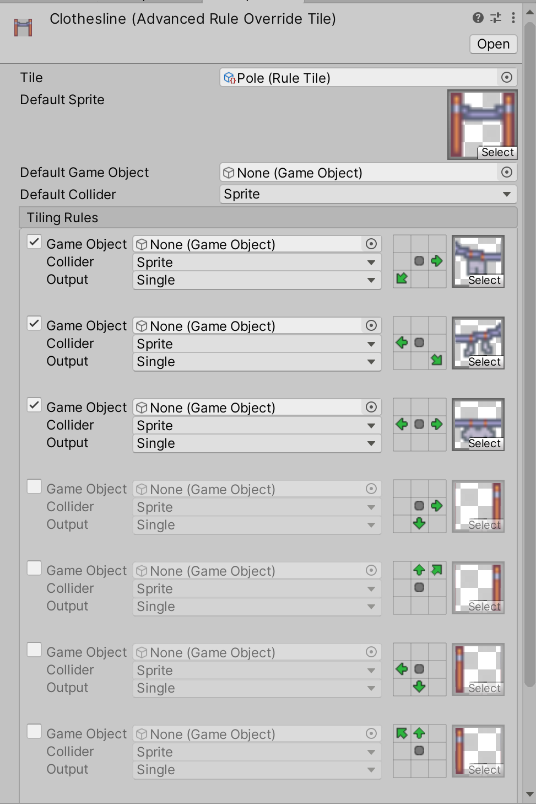
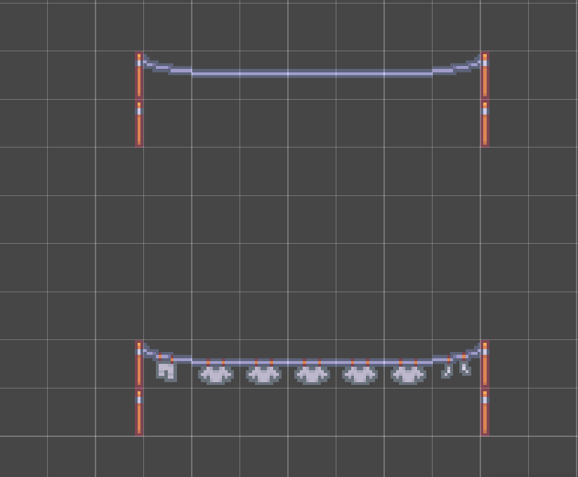

# Advanced Rule Override Tile

__Contributions by:__ [johnsoncodehk](https://github.com/johnsoncodehk), [Autofire](https://github.com/Autofire)

__Advanced Rule Override Tiles__ are Tiles which can override a subset of Rules for a given [Rule Tile](RuleTile.md) while maintaining most of the other set Rules of the Rule Tile. This allows you to create Tiles that provide specialized behavior in specific scenarios.

## Properties

| Property          | Function                                                     |
| ----------------- | ------------------------------------------------------------ |
| __Tile__          | The Rule Tile to override.                                   |

Depending on the Rule Tile that is overridden, there may be further properties which you can override here. Any public property in the Rule Tile that does not have a `RuleTile.DontOverride` attribute will be shown here and can be overridden.

## Usage

First select the Rule Tile to be overridden in the __Tile__ property. The Rule Override Tile editor then displays the different rules in the selected Rule Tile which you can override.

Select the Rule which you want to override by toggling the Rule. This will allow you to modify the output of the Rule, such as the Sprite, the GameObject or the Collider Type. The outputs are the same as the original [Rule Tile](RuleTile.md) and are detailed there. The matching Rule itself cannot be changed here and is displayed here to help identify it.

Paint with the Advanced  Rule Override Tile using the [Tile Palette](https://docs.unity3d.com/Manual/Tilemap-Painting.html) tools.

