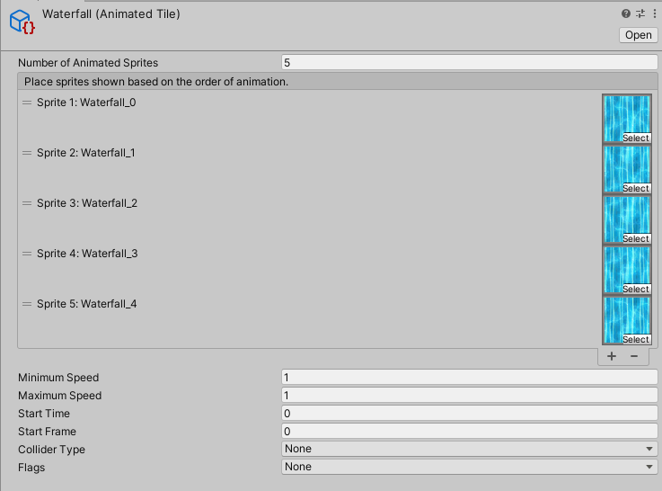
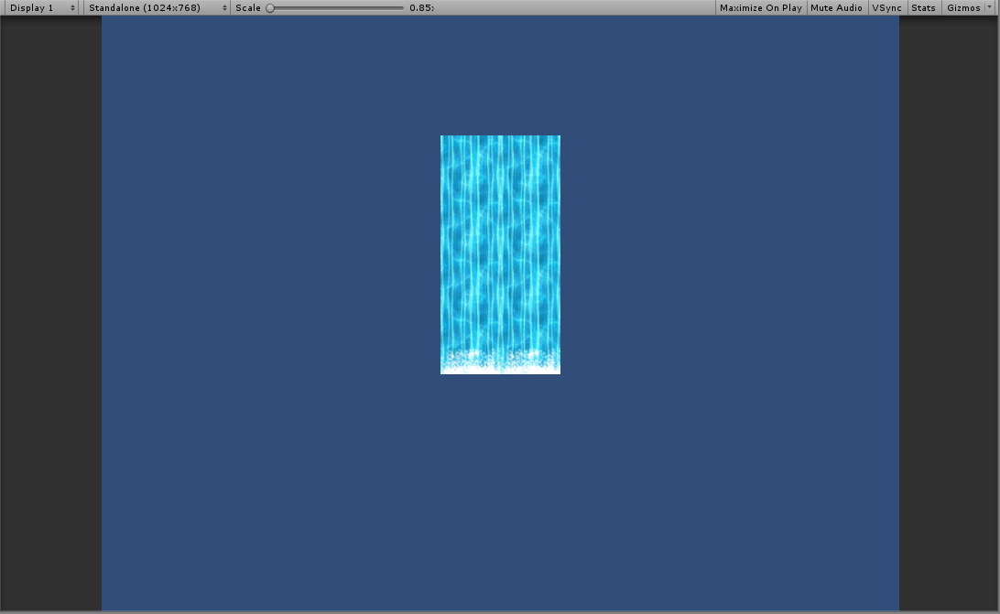

# Animated Tile

__Contribution by:__  [MahdiMahzuni](https://github.com/MahdiMahzuni)

Animated Tiles are tiles which run through and display a list of sprites in sequence.

### Properties

| Property                       | Function                                                     |
| ------------------------------ | ------------------------------------------------------------ |
| __Number of Animated Sprites__ | Number of Animated Sprites in the Animated Tile.             |
| __Sprite__                     | The Sprite set for the Animated Tile. This will be played in sequence. |
| __Minimum Speed__              | The minimum possible speed at which the Animation of the Tile will be played. A speed value will be randomly chosen between the minimum and maximum speed. |
| __Maximum Speed__              | The maximum possible speed at which the Animation of the Tile will be played. A speed value will be randomly chosen between the minimum and maximum speed. |
| __Start Time__                 | The starting time of this Animated Tile. This allows you to start the Animation from a particular time. |
| __Start Frame__                | The starting frame of this Animated Tile. This allows you to start the Animation from a particular Sprite in the list of Animated Sprites. |
| __Collider Type__              | The Collider Shape generated by the Tile.                    |

### Usage

Set up the Animated Tile with the Animated Sprites through the Animated Tile Editor.

Paint the Animated Tile using the Tile Palette tools.

