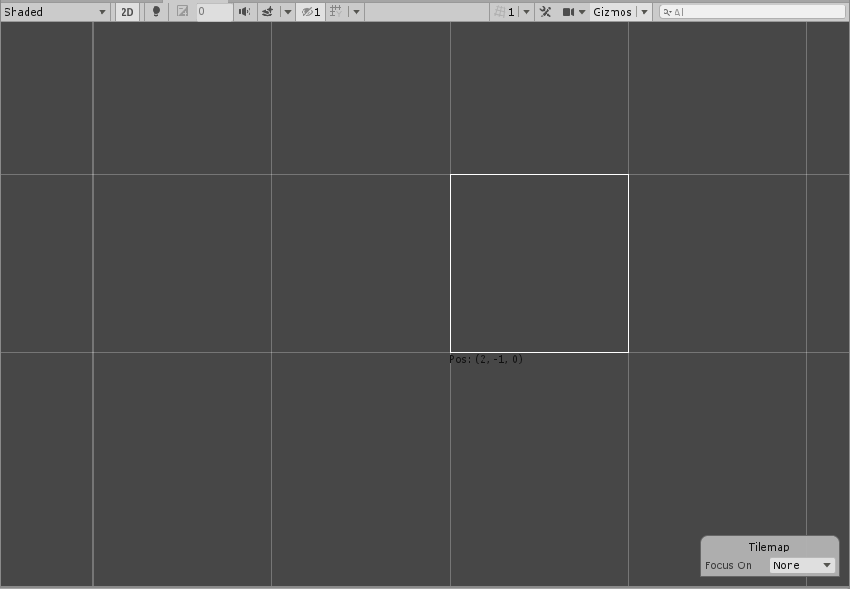

# Coordinate Brush

__Contributions by :__  [nicovain](https://github.com/nicovain), [pmurph0305](https://github.com/pmurph0305)

This Brush displays the coordinates of the it is currently targeting in the Scene view. Use this Brush as an example for creating custom Brushes that display extra visual features, such as cell coordinates or other information, while painting a Tilemap with the Brush.

 When painting with the Coordinate Brush in the Scene view, the position of the currently highlighted cell is displayed.

