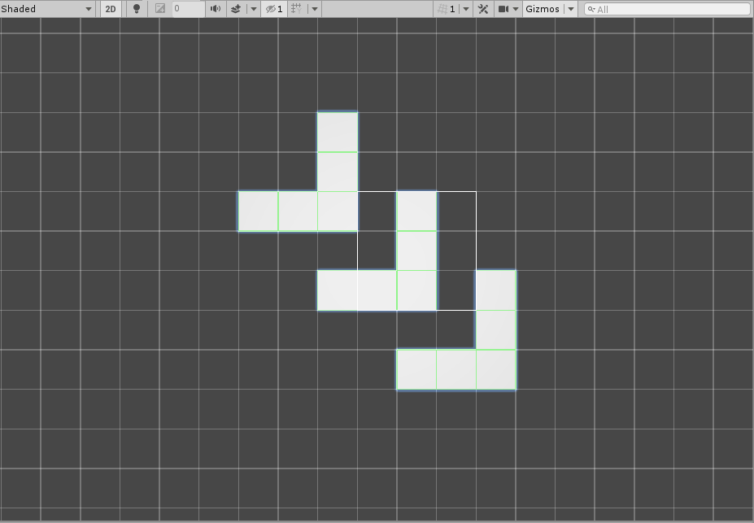

# GameObject Brush

This Brush instances, places and manipulates GameObjects onto the Scene. Use this Brush as an example for creating custom Brushes which can target and manipulate other GameObjects beside Tiles.

## Usage

First select the GameObject Brush from the Brush drop-down menu. With the Brush selected, then select the [Picker Tool](https://docs.unity3d.com/Manual/Tilemap-Painting.html#Picker) from the [Tile Palette](https://docs.unity3d.com/Manual/Tilemap-Painting.html) toolbar. Use the [Select Tool](https://docs.unity3d.com/Manual/Tilemap-Painting.html#Select) to select GameObjects from the Scene that you want the GameObject Brush to paint with. Note that these GameObjects must be a child of the active Grid to be selectable with this Brush.

When painting with the GameObject Brush, the Brush will instantiate GameObjects picked onto the Scene.

## Implementation

The GameObjectBrush inherits from the GridBrush and overrides several methods when implemented. The following methods are overridden:

- It overrides the Paint method to paint a GameObject. 
- It overrides the Erase method to erase the GameObjects from the Scene. 
- It overrides the BoxFill method to paint a GameObject in each cell defined by the [Box Tool](https://docs.unity3d.com/Manual/Tilemap-Painting.html#Rec). 
- It overrides the Move methods to move GameObjects in the Scene. 
- It overrides the Flip methods to flip GameObjects in the picked selection.