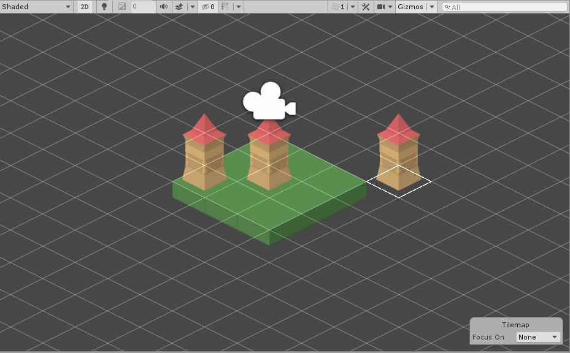

# Group Brush 

This Brush picks Tiles which are grouped together according to their position and its set properties. Set the __Gap__ value to identify which Tiles belong to the group, and set the __Limit__ value to ensure that the picked group remains within the desired size. Use this Brush as an example to create your own Brushes that can choose and pick specific Tiles 

## Properties

| Property  | Function                                                     |
| --------- | ------------------------------------------------------------ |
| __Gap__   | This value represents the minimum number of cells that must be in between picked Tiles. Only Tiles that are at least this many cells apart are picked by the Brush and placed in the group. Set this value to 0 to pick up all Tiles that are directly adjacent to each other in the group. |
| __Limit__ | This value represents the maximum number of cells around the initial picked position. Only Tiles within this range of cells are picked by the Brush and placed in the group. |

## Usage

Select the Group Brush, and use the [Picker Tool](https://docs.unity3d.com/Manual/Tilemap-Painting.html#Picker) and pick a position on the Tilemap. The Group Brush selects a group of Tiles based on its set properties and creates a Group.

## Implementation

The Group Brush inherits from the Grid Brush. It overrides the `Pick` method when picking a group of Tiles based on their position and its set properties.