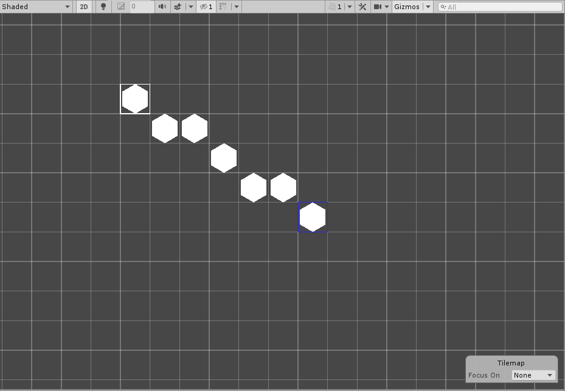
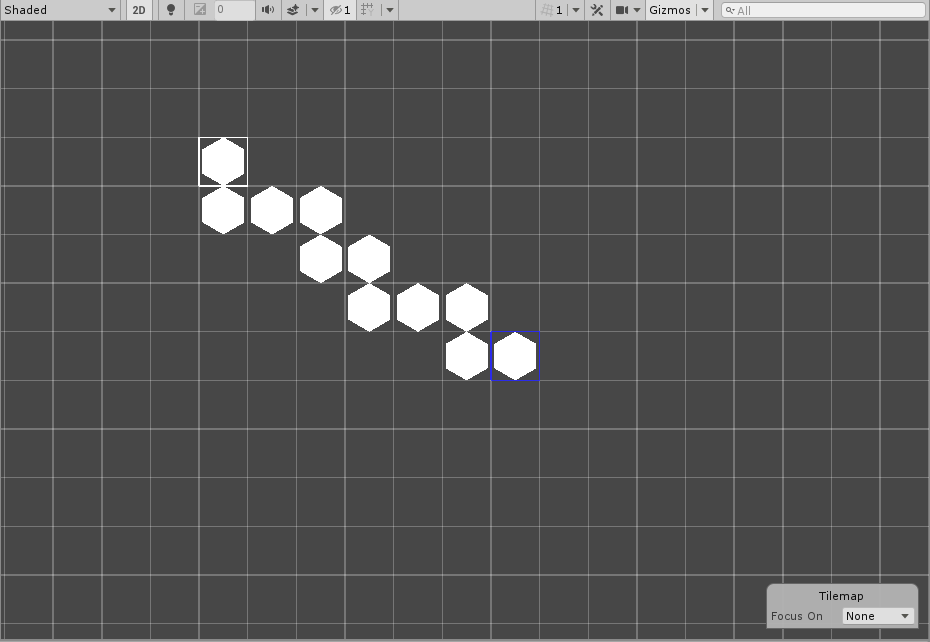

# Line Brush

__Contribution by :__  [CraigGraff](https://github.com/CraigGraff)

This Brush draws a line of Tiles onto a Tilemap. With this Brush selected, click once to set the starting point of the line and click again to set the ending point of the line. This Brush then draws a line of Tiles between the two points. 

Use this as an example to modify Brush painting behavior to make painting more efficient.

## Properties

| Property              | Function                                                     |
| --------------------- | ------------------------------------------------------------ |
| __Line Start Active__ | Indicates whether the Line Brush has started drawing a line. |
| __Fill Gaps__         | Ensures that there are orthogonal connections of Tiles from the start of the line to the end. |
| __Line Start__        | The current starting point of the line.                      |

## Usage
Select the Line Brush, then click once on the Tilemap to set the starting point of the line, then click a second time to set the ending point of the line. The Brush then draws the line of Tiles between the two set points. When the Line Brush is active, a blue outline will indicate the starting point of the line.

To have Tiles which are orthogonally connected from start to end, enable the __Fill Gaps__ property in the Brush Editor.

## Implementation

The Line Brush inherits from the Grid Brush and overrides the Paint method to implement the line painting functionality.