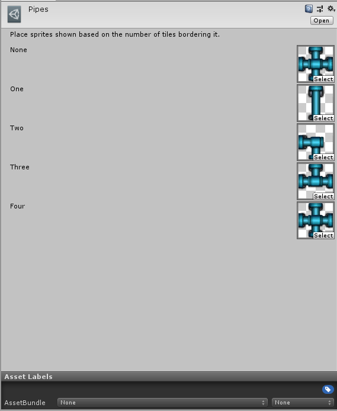
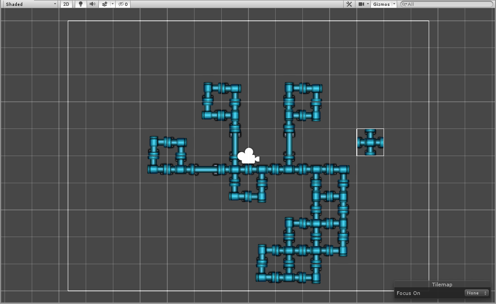

# Pipeline Tile

Pipeline Tiles are tiles which take into consideration its orthogonal neighboring tiles and displays a sprite depending on whether the neighboring tile is the same tile.

### Properties

| Property  | Function                                  |
| --------- | ----------------------------------------- |
| __None__  | The Sprite with no Tiles bordering it.    |
| __One__   | The Sprite with one Tile bordering it.    |
| __Two__   | The Sprite with two Tiles bordering it.   |
| __Three__ | The Sprite with three Tiles bordering it. |
| __Four__  | The Sprite with four Tiles bordering it.  |

### Usage

Set up the Pipeline Tile with the Sprites fitting the number of Tiles bordering the Sprite.

Paint the Pipeline Tile using the Tile Palette tools.

