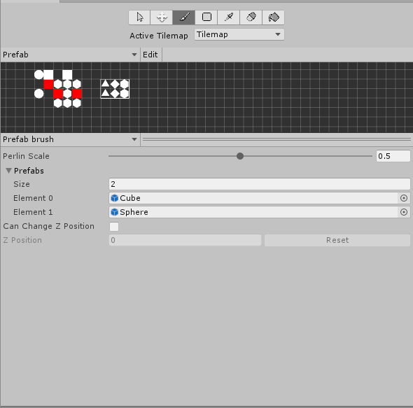
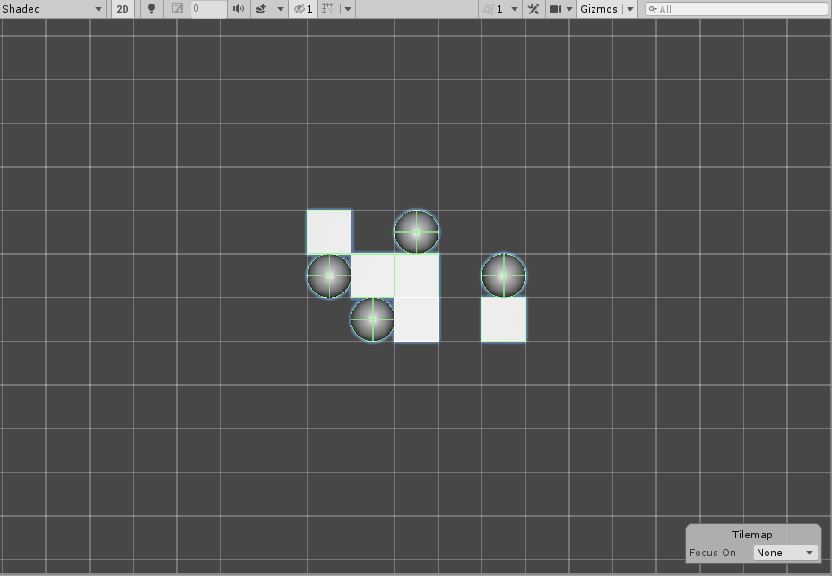

# Prefab Brush

__Contributions by:__  [Pepperized](https://github.com/Pepperized), [superkerokero](https://github.com/superkerokero), [vladderb](https://github.com/vladderb), [RyotaMurohoshi](https://github.com/RyotaMurohoshi), [ManickYoj](https://github.com/ManickYoj), [Quickz](https://github.com/Quickz)

This Brush instances and places randomly selected Prefabs onto the target location and parents the instanced object to the [paint target](https://docs.unity3d.com/Manual/Tilemap-Painting.htm). Use this Brush as an example to create custom Brushes which can quickly place an assortment of GameObjects onto structured locations.

## Properties

<table>
<thead>
<tr>
<th><strong>Property</strong></th>
<th colspan="2"><strong>Function</strong></th>
</tr>
</thead>
<tbody>
<tr>
<td><strong>Perlin Scale</strong></td>
<td colspan="2">The factor using the <a href="https://en.wikipedia.org/wiki/Perlin_noise">Perlin noise</a> algorithm for the random distribution of Prefabs chosen when painting.</td>
</tr>
<tr>
<td><strong>Prefabs</strong></td>
<td colspan="2">Set the number of and selection of Prefabs to paint from.</td>
</tr>
<tr>
<td></td>
<td><strong>Size</strong></td>
<td>Set the number of Prefabs that the Brush selects from.</td>
</tr>
<tr>
<td></td>
<td><strong>Element *</strong></td>
<td>Set one of the Prefabs to select from for each entry. The number of <b>Element</b> entries matches the value set in <b>Size</b>.</td>
</tr>
</tbody>
</table>

## Usage

First set the number of Prefabs to select from in the __Prefabs__ property, then add Prefab Assets to the list. Adjust the __Perlin Scale__ property to adjust the distribution of Prefabs painted onto a particular cell. 

When painting with the Prefab Brush, the Prefab Brush picks from the available Prefabs based on the __Perlin Scale__ set, and instantiate the Prefabs to the Scene.

## Implementation

The Prefab Brush inherits from the Grid Brush and implements the following overrides:

- It overrides the `Paint` method to paint a Prefab from the Prefab selection. 
- It overrides the `Erase` method to be able to erase the instantiated Prefabs or other GameObjects from the Scene.