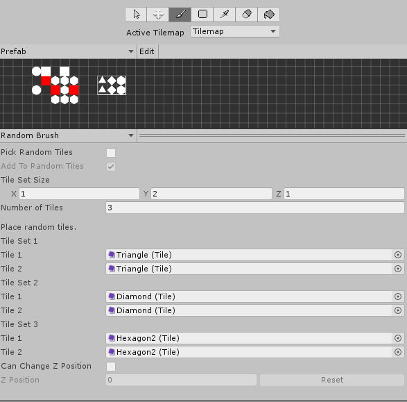
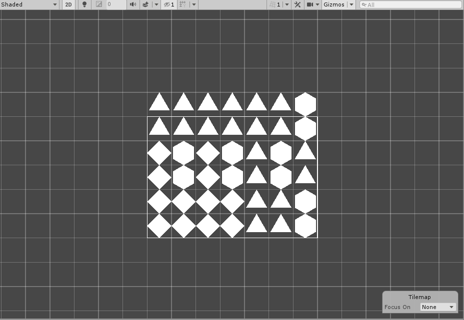

# Random Brush

This Brush places random Tiles onto a Tilemap. Use this as an example to create Brushes which store specific data per Brush, and to make Brushes which randomize behavior.

## Properties

| Property                | Function                                                     |
| ----------------------- | ------------------------------------------------------------ |
| __Pick Random Tiles__   | Enable this property to pick the Tiles from the current selection as a random Tile Set. |
| __Add To Random Tiles__ | Enable this property to add the picked Tile Sets to existing Tile Sets instead of replacing them. |
| __Tile Set Size__       | The size of each Tile Set.                                   |
| __Number of Tiles__     | The number of Tile Sets.                                     |
| __Tile Set__            | The Tile Set to randomize from                               |
| __Tiles__               | The Tiles in the Tile Set.                                   |

## Usage

To create Tile Sets, first define the size of the Tile Set you want to paint by setting a value on the Tile Set Size property. Then you can add Tile Sets manually with the Brush Editor or select them from an existing Tile Palette.

To select Tile Sets from an existing Tile Palette, enable the __Pick Random Tiles__ property and select the Tile Sets using the [Picker Tool](https://docs.unity3d.com/Manual/Tilemap-Painting.html#Picker). This will create a Tile Set, or multiple Sets if the picked size is larger than the Tile Set Size property. Enable the __Add To Random Tiles__ property to add a picked selection of Tiles onto new or existing Tile Sets instead of replacing them.

When painting with the Random Brush, the Random Brush will randomly pick from the available Tile Sets while filling Tiles. 

## Implementation

The RandomBrush inherits from the GridBrush and implements the following overrides:

- It overrides the Paint method to paint random selections of Tiles from chosen Tile Sets. 
- It overrides the Pick method to be able to pick selections of Tiles for the random Tile Sets.
