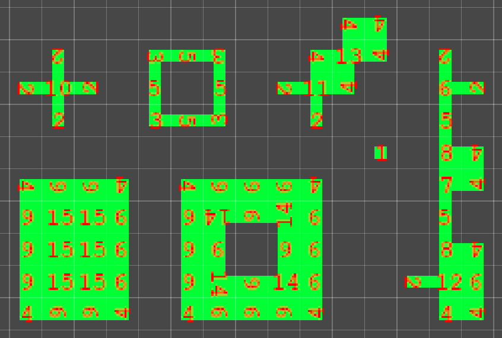

# Random Terrain Tile

Very similar to the Terrain Tile, but this supports an array of sprites for each property, and applies them randomly, at the time of the placement.

## Properties

The following properties describe the appearance of Sprites representing terrain or walls. Assign Sprites that matches the description to each of these properties.

| Property                              | Function                                                     |
| ------------------------------------- | ------------------------------------------------------------ |
|  1. __Filled__                        | Sprites with all sides filled.                              |
|  2. __Three Sides__                   | Sprites with three sides.                                   |
|  3. __Two Sides and One Corner__      | Sprites with two sides and one corner without adjacent sides. |
|  4. __Two Adjacent Sides__            | Sprites with two adjacent sides.                            |
|  5. __Two Opposite Sides__            | Sprites with two opposite sides across each other.          |
|  6. __One Side and Two Corners__      | Sprites with a single side and two corners without adjacent sides. |
|  7. __One Side and One Lower Corner__ | Sprites with one side and a corner in the lower half of the Sprite. |
|  8. __One Side and One Upper Corner__ | Sprites with one side and a corner in the upper half of the Sprite. |
|  9. __One Side__                      | Sprites with a single side.                                 |
| 10. __Four Corners__                  | Sprites with four unconnected corners without adjacent sides. |
| 11. __Three Corners__                 | Sprites with three corners without adjacent sides.          |
| 12. __Two Adjacent Corners__          | Sprites with two adjacent corners.                          |
| 13. __Two Opposite Corners__          | Sprites with two opposite corners across each other.        |
| 14. __One Corner__                    | Sprites with a single corner with no adjacent sides.        |
| 15. __Empty__                         | Sprites without any terrain.                                |

## Usage

The Random Terrain Tile is a copy of Terrain Tile with the only difference that it supports multiple sprites for each level.

The image below may be of help to know how to position tiles in a way to facilitate their positioning. Such layout works for Terrain Tiles too, by the way.

