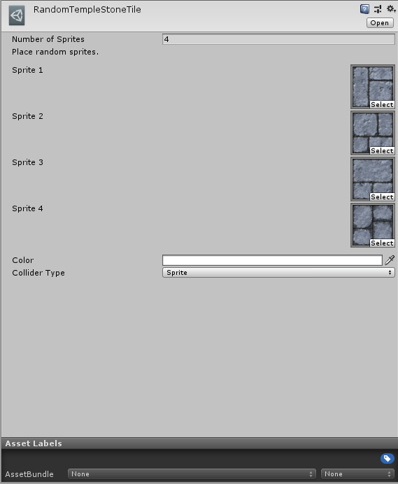
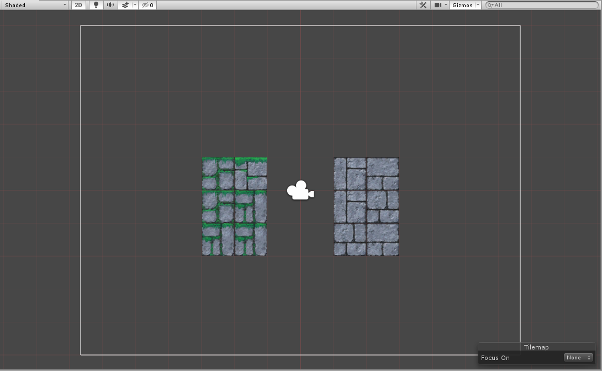

# Random Tile

Random Tiles are tiles which pseudo-randomly pick a sprite from a given list of sprites and a target location, and displays that sprite. The Sprite displayed for the Tile is randomized based on its location and will be fixed for that particular location.

### Properties

| Property              | Function                                  |
| --------------------- | ----------------------------------------- |
| __Number of Sprites__ | The number of Sprites to randomize from.  |
| __Sprite__            | A Sprite to randomize with.               |
| __Color__             | The Color of the Tile.                    |
| __Collider Type__     | The Collider Shape generated by the Tile. |

### Usage

Set up the Random Tile with the Sprites to select from.

Paint the Random Tile using the Tile Palette tools.

