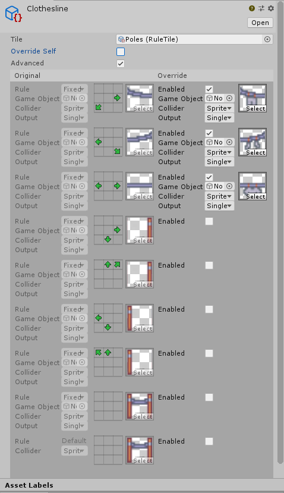

# Rule Override Tile

###### *Contributions by: johnsoncodehk, Autofire *

Rule Override Tiles are Tiles which can override a subset of Rules for a given Rule Tile to provide specialised behaviour while keeping most of the Rules originally set in the Rule Tile.

### Properties

| Property          | Function                                                     |
| ----------------- | ------------------------------------------------------------ |
| __Tile__          | The Rule Tile to override.                                   |
| __Override Self__ | Enable this so that this Tile only accepts instances of itself when matching Rules. |
| __Advanced__      | Enable Advanced Mode. Enable this if you want to specify which Rules to override. |

### Usage

Set up the Rule Override Tile with the Rule Tile to override. The Rule Override Tile Editor will pick up the items to override and show them.

In normal mode, the Editor will show all the Sprites that are used in the Rule Tile on the left. Place the Sprites to override the ones on the right. When the Rule Tile has a match outputting the Sprite on the left, it will instead output the Sprite specified on the right.

In advanced mode, the Editor will show all the Rules that are used in the Rule Tile on the left. To override a Rule, check the Enabled box and override the output by specifing the desired output instead.

Paint the Rule Override Tile using the Tile Palette tools.

