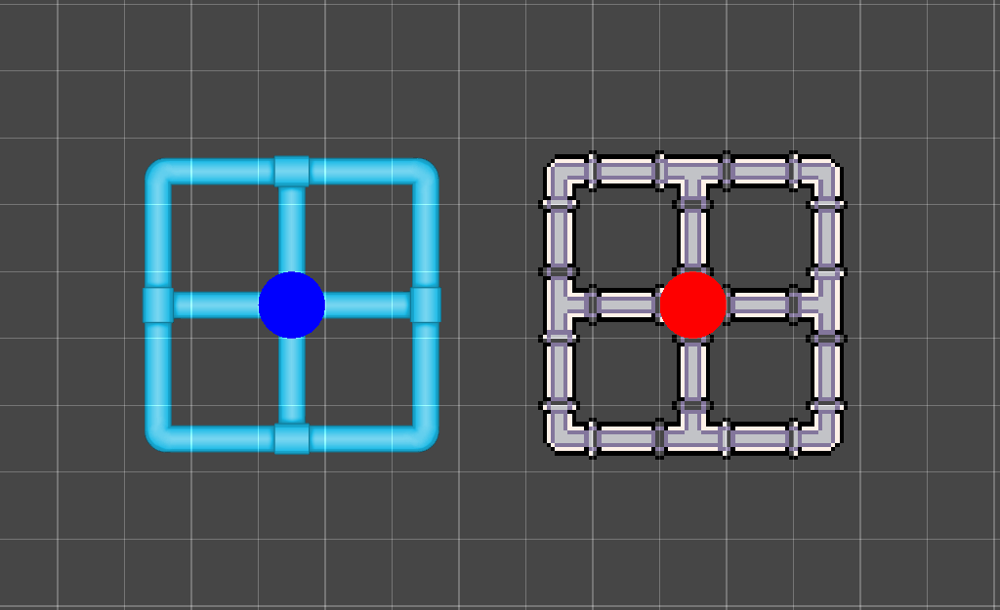

# Rule Override Tile

__Contributions by:__ [johnsoncodehk](https://github.com/johnsoncodehk), [Autofire](https://github.com/Autofire)

__Rule Override Tiles__ are Tiles which can override the Sprites and GameObjects for a given [Rule Tile](RuleTile.md) while maintaining the Rule set of the Rule Tile. This allows you to create Tiles that provide variations of a Rule Tile without setting new Rules.

## Properties

| Property          | Function                                                     |
| ----------------- | ------------------------------------------------------------ |
| __Tile__          | The Rule Tile to override.                                   |

Depending on the Rule Tile that is overridden, there may be further properties which you can override here. Any public property in the Rule Tile that does not have a `RuleTile.DontOverride` attribute will be shown here and can be overridden.

## Usage

First select the Rule Tile to be overridden in the __Tile__ property. The Editor then displays the different Sprites and GameObjects in the selected Rule Tile which you can override.

The editor displays the original Sprites that are used in the Rule Tile in the left column. Select the Sprites that override each of the respective original Sprites on the right ‘Override’ column. When the Rule Tile has a match that would usually output the original Sprite, it will instead output the override Sprite. 

Below that, the editor displays the original GameObjects that are used in the Rule Tile in the left column. Select the GameObjects that override each of the respective original GameObjects on the right ‘Override’ column. When the Rule Tile has a match that would usually output the original GameObject, it will instead output the override GameObject.

If you have modified the original Rule Tile and changed the Sprites there, the Rule Override Tile will note that the original Sprites are missing. You can check the original Rule Tile to see if it is set up correctly or set the Override Sprites to None to remove the override.

Paint with the Rule Override Tile using the [Tile Palette](https://docs.unity3d.com/Manual/Tilemap-Painting.html) tools.

