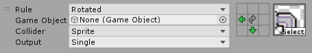
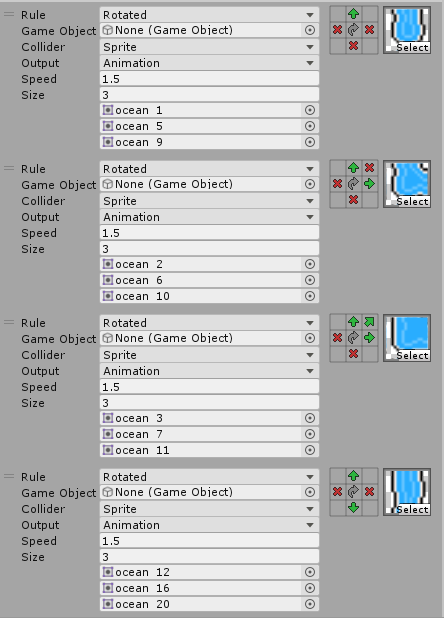

# Rule Tile

###### *Contributions by: johnsoncodehk, DreadBoy, AVChemodanov, DoctorShinobi *

Generic visual tile for creating different tilesets like terrain, pipeline, random or animated tiles.

The Rule Tile is for the Rectangle Grid type. For the Hexagonal Grid type, please use the Hexagonal Rule Tile. For the Isometric Grid types, please use the Isometric Rule Tile. The same properties apply for all Rule Tiles.

### Properties

| Property                | Function                                                |
| ----------------------- | ------------------------------------------------------- |
| __Default Sprite__      | The Default Sprite set when creating a new Rule.        |
| __Default Game Object__ | The Default GameObject set when creating a new Rule.    |
| __Default Collider__    | The Default Collider Type set when creating a new Rule. |

#### Tiling Rules

| Property        | Function                                            |
| --------------- | --------------------------------------------------- |
| __Rule__        | The Rule Type for this Rule.                        |
| __Game Object__ | The GameObject for the Tile which fits this Rule.   |
| __Collider__    | The Collider Type for the Tile which fits this Rule |
| __Output__      | The Output for the Tile which fits this Rule.       |

#### Output: Fixed

| Property   | Function                                      |
| ---------- | --------------------------------------------- |
| __Sprite__ | The Sprite for the Tile which fits this Rule. |

#### Output: Random

| Property    | Function                                                     |
| ----------- | ------------------------------------------------------------ |
| __Noise__   | The Perlin Noise factor when placing the Tile.               |
| __Shuffle__ | The randomized transform given to the Tile when placing it.  |
| __Size__    | The number of Sprites to randomize from.                     |
| __Sprite__  | The Sprite for the Tile which fits this Rule. A random Sprite will be chosen out of this when placing the Tile. |

#### Output: Animation

| Property   | Function                                                     |
| ---------- | ------------------------------------------------------------ |
| __Speed__  | The speed at which the Animation is played.                  |
| __Size__   | The number of Sprites in the Animation.                      |
| __Sprite__ | The Sprite for the Tile which fits this Rule. A random Sprite will be chosen out of this when placing the Tile. |

### Usage

Set up the Rule Tile with the required rules with the Rule Tile Editor. In the Rule Tile Editor, you can change, add or remove Rules in the Tiling Rules list. Click on the + or - buttons to add or remove Rules. Drag existing Rules up or down to change the order of the Rule in the list.

When a new Rule is added, you will see a list of Rule properties, a 3x3 box and a Sprite selector. You can modify these to get the Rule that you want matched. The Sprite selected and the other properties of the Rule Tile will then be applied to the cell.

For setting up a Rule, you will need to edit the 3x3 box. The 3x3 box represents the neighbors a Tile can have, where the eight bordering cells are the neighbors in those directions and the center cell is the Tile itself. Each of the neighboring cells can be set with 3 matching options: Don't Care, This and Not This. 

- Don't Care:  The Rule Tile will not care about the contents of the cell in that direction
- This: The Rule Tile will check if the contents of the cell in that direction is an instance of this Rule Tile. If not, the rule will fail.
- Not This: The Rule Tile will check if the contents of the cell in that direction is not an instance of this Rule Tile. If it is, the rule will fail.

If all of the neighbors match exactly according to the options set in each direction, the rule will be matched and the contents of this Rule will be applied.

When the Rule is set to Rotated, the 3x3 box will be rotated 90 degrees each time the Rule fails to match and it will try to match again with this rotated 3x3 box. If the Rule now matches, the contents of this Rule will be applied as well as the rotation required to match the Rule. Use this if you want the Rule to match for the four 90 degree rotations if rotation is possible.

When the Rule is set to Mirror X or Mirror Y, the 3x3 box will be mirrored in that axis each time the Rule fails to match and it will try to match again with this mirrored 3x3 box. If the Rule now matches, the contents of this Rule will be applied as well as the mirroring required to match the Rule. Use this if you want the Rule to match for the mirrored locations if mirroring is possible.

If you want the Rule Tile to have a Random output, you can set the Output to Random. This will allow you to specify a number of input Sprites to randomize from. The rotation of the Sprites can be randomized as well by changing the __Shuffle__ property.

If you want the Rule Tile to output a Sprite Animation, you can set the Output to Animation. This will allow you to specify a number of Sprites to animate sequentially. The speed of the Animation can be randomized as well by changing the __Speed__ property.

Paint the Rule Tile using the Tile Palette tools.

For optimization, please set the most common Rule at the top of the list of Rules and follow with next most common Rule and so on. When matching Rules during the placement of the Tile, the Rule Tile algorithm will check the first Rule first, before proceeding with the next Rules.