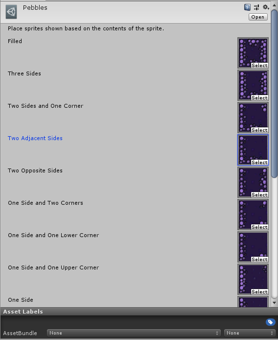
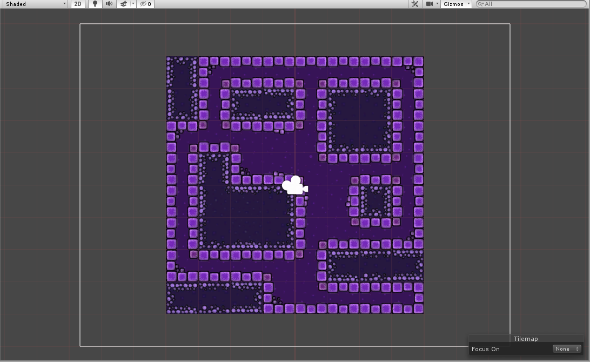

# Terrain Tile

Terrain Tiles, similar to Pipeline Tiles, are tiles which take into consideration its orthogonal and diagonal neighboring tiles and displays a sprite depending on whether the neighboring tile is the same tile.

### Properties

| Property                          | Function                                |
| --------------------------------- | --------------------------------------- |
| __Filled__                        | The Sprite fitting this characteristic. |
| __Three Sides__                   | The Sprite fitting this characteristic. |
| __Two Sides and One Corner__      | The Sprite fitting this characteristic. |
| __Two Adjacent Sides__            | The Sprite fitting this characteristic. |
| __Two Opposite Sides__            | The Sprite fitting this characteristic. |
| __One Side and Two Corners__      | The Sprite fitting this characteristic. |
| __One Side and One Lower Corner__ | The Sprite fitting this characteristic. |
| __One Side and One Upper Corner__ | The Sprite fitting this characteristic. |
| __One Side__                      | The Sprite fitting this characteristic. |
| __Four Corners__                  | The Sprite fitting this characteristic. |
| __Three Corners__                 | The Sprite fitting this characteristic. |
| __Two Adjacent Corners__          | The Sprite fitting this characteristic. |
| __Two Opposite Corners__          | The Sprite fitting this characteristic. |
| __One Corner__                    | The Sprite fitting this characteristic. |
| __Empty__                         | The Sprite fitting this characteristic. |

### Usage

Set up the Terrain Tile with the Sprites fitting the number of Tiles bordering the Sprite.

Paint the Terrain Tile using the Tile Palette tools.

