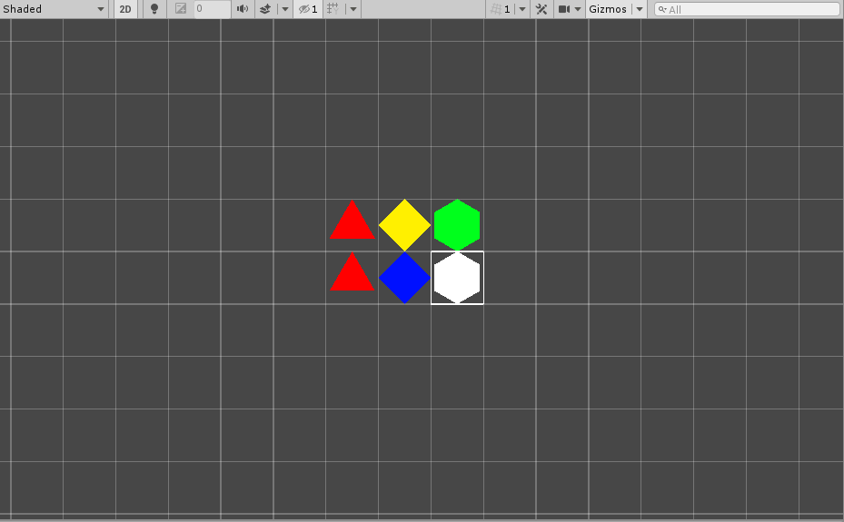

# Tint Brush

This Brush changes the color of Tiles placed on a Tilemap.

### Properties

| Property  | Function                  |
| --------- | ------------------------- |
| __Color__ | Color of the Tile to tint |

### Usage

To set a color to tint a Tile with, change the __Color__ property to the desired color.

To change a color of a Tile, use the Paint tool to set the color of the Tile.

### Implementation

The TintBrush inherits from the GridBrush. It overrides the Paint method to set the color of a Tile. It overrides the Erase method to be able to set the color of a Tile back to the default white color.