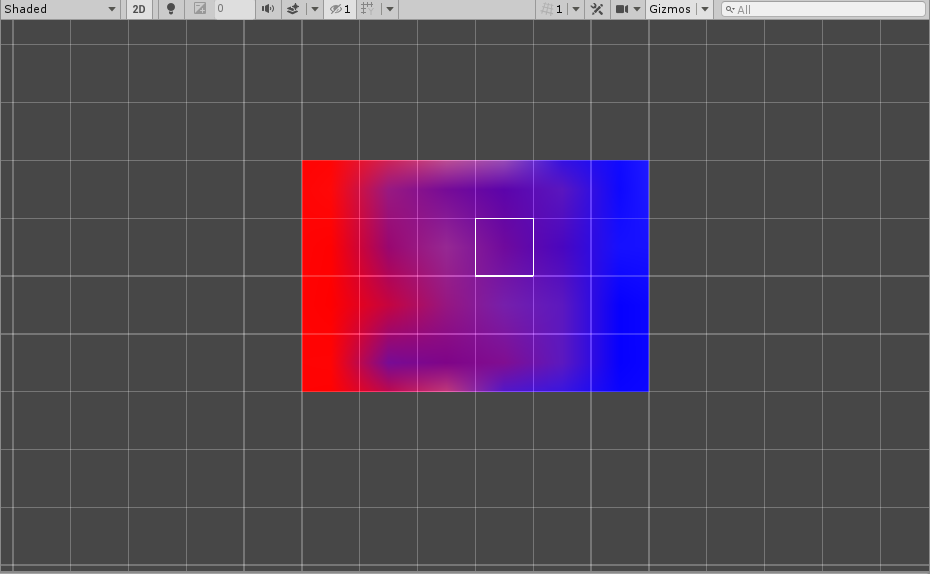

# Tint Brush (Smooth)

This advanced Tint Brush interpolates tint color per-cell. This requires the use of a custom shader (see TintedTilemap.shader) and a helper component TileTextureGenerator.

### Properties

| Property  | Function                                                     |
| --------- | ------------------------------------------------------------ |
| __Color__ | Color of the Tile to tint                                    |
| __Blend__ | Factor to blend the Color of Tile with its color and this Brush's color |

### Usage

The TilemapRenderer needs to have a material set up with the TintedTilemap.shader. The TilemapRenderer also needs to have the TileTextureGenerator component.

To set a color to tint a Tile with, change the __Color__ property to the desired color or pick the Color from an existing Tile. 

To blend the chosen color with the color of the Tile, set the __Blend__ property. A lower value will weight the new color with the existing color of the Tile, while a higher value will weight the new color with the color of the Brush.

To change a color of a Tile, use the Paint tool to set the color of the Tile.

### Implementation

The TintBrushSmooth inherits from the GridBrushBase. It overrides the Paint method to set the color of a Tile. It overrides the Erase method to be able to set the color of a Tile back to the default white color. It overrides the Pick method to pick the color of a Tile.