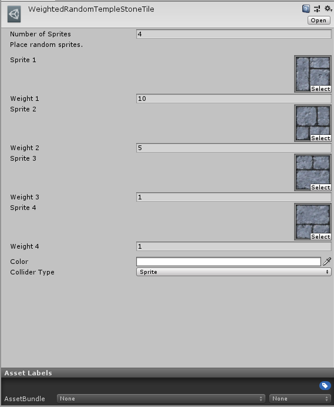
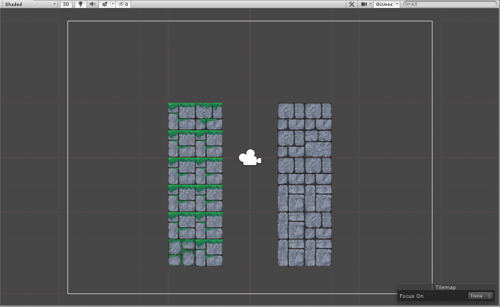

# Weighted Random Tile

__Contributions by:__  [nicovain](https://github.com/nicovain), [distantcam](https://github.com/distantcam)

Weighted Random Tiles are Tiles which randomly pick a Sprite from a given list of Sprites and displays that Sprite at the target location. Adjusting the __Weight__ value of the Sprites changes their probability of appearing. The Sprite displayed for the Tile is randomized based on its location and remains fixed for that particular location.

## Properties

| Property              | Function                                                     |
| --------------------- | ------------------------------------------------------------ |
| __Number of Sprites__ | The number of Sprites to randomize from.                     |
| __Sprite__            | A Sprite that is in the randomize pool.                      |
| __Weight__            | A Weight value of the Sprite that affects its probability of appearing. |
| __Color__             | The color of the Tile.                                       |
| __Collider Type__     | The __Collider Shape__ generated by the Tile.                |

## Usage

Select the Sprites to randomize from in the Weighted Random Tile editor. The Weight of each Sprite determines the probability of the appearance of the Sprite where the higher the weight, the higher the probability of appearance.

Paint the Weighted Random Tile onto the Tilemap with the Tile Palette tools.

