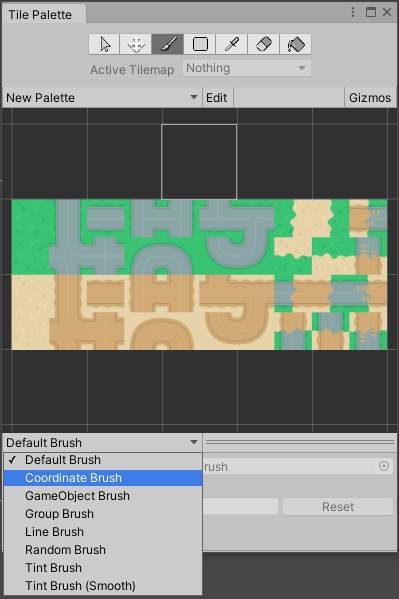

# 2D Tilemap Extras

The 2D Tilemap Extras package contains reusable 2D and __Tilemap Editor__ scripts which you can use for your own Projects. You can freely customize the behavior of the scripts to create new Brushes that suit different scenarios. 

To find the additional Brushes, open the Tile Palette window (menu: __Window > 2D > Tile Palette__) and open the Brush drop-down menu near the bottom of the editor. Select from the available Brush options for different effects.

The source code for these scripts can be found in the repository [2d-extras](https://github.com/Unity-Technologies/2d-extras "2d-extras: Extras for 2d features"), and examples of the implemented scripts can be found in the sister repository [2d-techdemos](https://github.com/Unity-Technologies/2d-techdemos "2d-techdemos: Examples for 2d features").

## Brushes

- [Coordinate](CoordinateBrush.md): This Brush displays the cell coordinates it is targeting in the Scene view. Use this as an example to create Brushes that display extra visualization features when painting onto a Tilemap in the Scene view.

- [GameObject](GameObjectBrush.md): This Brush instances, places and manipulates GameObjects onto the Scene. Use this as an example to create Brushes which targets GameObjects other than Tiles for instancing and manipulation.

- [Group](GroupBrush.md): This Brush picks groups of Tiles based on their positions relative to each other. Adjust the size of groups the Brush picks by setting the Gap and Limit properties. Use this Brush as an example to create Brushes that pick Tiles based on specific criteria.

- [Line](LineBrush.md): This Brush draws a line of Tiles between two points onto a Tilemap. Use this as an example to modify Brush painting behavior to make painting more efficient.

- [Random](RandomBrush.md): This Brush places random Tiles onto a Tilemap. Use this as an example to create Brushes which store specific data per Brush and to make Brushes which randomize behavior.

- [Prefab](PrefabBrush.md): This Brush instances and places randomly selected Prefabs onto the target location and parents the instanced object to the paint target. Use this as an example to quickly place an assortment of GameObjects onto structured locations. Note that the Brush drop-down menu does not contain a default Prefab Brush.

- [Tint Brush](TintBrush.md): This Brush changes tint colors of Tiles placed on a Tilemap per-cell.

- [Tint Brush (Smooth)](TintBrushSmooth.md): An advanced Tint Brush that interpolates tint colors per-cell. This requires the use of a custom Shader (TintedTilemap.shader) and a  helper component TileTextureGenerator. Both are included in this package and found here: `[Root]\Runtime\Brushes`

  

## Tiles

You can create (menu: __Create > Tiles__ ) the following additional Tile types that are included with this package.

- [Animated](AnimatedTile.md): This Tile runs through and displays a list of Sprites in sequence to create a frame-by-frame animation.
- [Pipeline](PipelineTile.md): This Tile considers its orthogonal neighbor Tiles when displaying a Sprite.
- [Random](RandomTile.md): This Tile pseudorandomly picks a Sprite from a given list of Sprites and displays that Sprite at the target location.
- [Terrain](TerrainTile.md): This Tile considers its orthogonal and diagonal neighbor Tiles and displays a Sprite depending on whether the neighboring tile is the same Tile.
- [Rule Tile](RuleTile.md): This is a generic visual Tile that accepts rules you create with the __Tiling Rules__ to create different Tilesets. Rule Tiles are the basis of the Terrain, Pipeline, Random or Animated Tiles. This is the default Rule Tile and is only used with the Rectangle Grid type Tilemap. Use the Hexagonal and Isometric Rule Tiles instead for their respective Grid types.
- __Hexagonal Rule Tile__: A Rule Tile for [Hexagonal Grids](https://docs.unity3d.com/2018.3/Documentation/Manual/Tilemap-Hexagonal.html). Enable the ‘Flat Top’ property for a Flat Top Hexagonal Grid, or clear it for a Pointed Top Hexagonal Grid.
- __Isometric Rule Tile__: A Rule Tile for use with [Isometric Grids](https://docs.unity3d.com/2018.3/Documentation/Manual/Tilemap-Isometric-CreateIso.html).
- [Rule Override Tile](RuleOverrideTile.md): This Tile can override a subset of Rules for a given [Rule Tile](RuleTile.md) to provide specialized behavior, while keeping the rest of the original Rules intact.
- [Weighted Random](WeightedRandomTile.md): Weighted Random Tiles are Tiles which randomly pick a Sprite from a given list of Sprites and displays the picked Sprite at a target location. Each Sprite can be given a different weight value to change its probability of appearing.

## Other

- [GridInformation](GridInformation.md): A simple MonoBehavior that stores and provides information based on Grid positions and keywords.
- [Custom Rules for RuleTile](CustomRulesForRuleTile.md): This helps to create new custom Rules for the Rule Tile with more options.